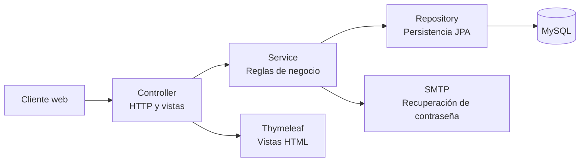

# Documento Técnico de Entrega — SISPE

## Información general

| Campo | Detalle |
|---|---|
| Proyecto | SISPE — Sistema de Gestión de Servicios |
| Tecnología | Java 17, Spring Boot, Spring MVC, Spring Data JPA, Thymeleaf |
| Institución | SENA — Servicio Nacional de Aprendizaje |
| Programa | Análisis y Desarrollo de Software (ADSO) |
| Trimestre | Tercer trimestre |
| Tipo de entrega | Diseño de aplicación Java estructurada |
| Instructor / evaluador | Ing. William Ramón Flórez |

## Equipo desarrollador

- Juan David
- Victor Solano
- Adrian Arias
- Jerson Carvajal

## Descripción del producto

SISPE es una aplicación web para la gestión integral de servicios de un establecimiento. El sistema administra autenticación y usuarios, menú, pedidos, mesas, insumos, facturación y reportes, aplicando una arquitectura por capas que facilita la lectura, las pruebas y el mantenimiento del código.


## Requisitos

- Java 17+
- Maven 3.9+ (o Maven Wrapper si está disponible)
- MySQL 8+ y una base de datos llamada `sistema`
- Opcional: cuenta SMTP para recuperación de contraseña

## Ejecución local

1. Configure las variables de entorno antes de iniciar:

```bash
export DB_URL='jdbc:mysql://localhost:3306/sistema'
export DB_USERNAME='root'
export DB_PASSWORD=''
export MAIL_USERNAME='cuenta@dominio.com'
export MAIL_PASSWORD='contraseña-de-aplicación'
```

2. Ejecute la aplicación desde esta carpeta:

```bash
mvn spring-boot:run
```

La aplicación queda disponible en `http://localhost:8080`.

## Configuración y seguridad

La configuración usa placeholders de Spring y no contiene credenciales reales. No agregue contraseñas al repositorio. En entornos compartidos, use variables de entorno o un gestor de secretos. El correo requiere una contraseña de aplicación SMTP; no use la contraseña personal de la cuenta.

## Arquitectura

El proyecto sigue una separación MVC por capas:



- `controller`: endpoints web y API, validación de entrada y selección de vistas.
- `service`: casos de uso y reglas de negocio.
- `repository`: interfaces Spring Data JPA para acceso a datos.
- `model`: entidades y objetos de dominio.
- `dto`, `mapper`: contratos de transporte y conversión entre capas.
- `config`: seguridad, codificación de contraseñas y configuración de calidad.

Los paquetes de la aplicación están normalizados a minúsculas: `controller`, `model`, `repository` y `service`.

## Pruebas y calidad

Ejecute las pruebas unitarias y de controlador con:

```bash
mvn test
```

Para compilar, probar y generar el informe JaCoCo:

```bash
mvn verify
```

El informe se genera en `target/site/jacoco/index.html`. Para una revisión SonarQube, configure el servidor y ejecute el análisis con el plugin Sonar correspondiente; los reportes generados no deben versionarse.

## Criterios de entrega

- Java 17 y Spring Boot configurados en Maven.
- Separación MVC y responsabilidades por capa.
- Pruebas existentes conservadas y actualizadas a los paquetes normalizados.
- JavaDoc en el punto de entrada y documentación técnica reproducible.
- Credenciales externas a código fuente mediante variables de entorno.
- JaCoCo integrado al ciclo `verify`.

## Lista de chequeo de entrega

- [x] **Código fuente organizado:** paquetes separados por configuración, modelo, repositorios, servicios, controladores, DTO y mapeadores.
- [x] **Documentación JavaDoc:** clase principal documentada con descripción, parámetros y responsabilidades.
- [x] **Documento de arquitectura:** este README contiene la descripción funcional, estructura de paquetes y diagrama de arquitectura.
- [x] **Patrón MVC / arquitectura en capas:** la interfaz, los controladores, la lógica de negocio y la persistencia están separadas.
- [x] **Mantenibilidad:** nombres claros, paquetes normalizados en minúsculas y responsabilidades delimitadas.
- [x] **Seguridad:** credenciales de base de datos y correo configuradas mediante variables de entorno.
- [x] **Pruebas y calidad:** pruebas Maven y generación de cobertura JaCoCo integradas al proyecto.

## Declaración del equipo

El equipo desarrollador declara que el presente documento corresponde al proyecto SISPE construido durante el tercer trimestre y que la estructura descrita coincide con la implementación disponible en el código fuente.

**Desarrolladores:** Juan David, Victor Solano, Adrian Arias y Jerson Carvajal.

## Estructura resumida

```text
src/main/java/com/sispe/springboot_web
├── config
├── controller
├── dto
├── mapper
├── model
├── repository
└── service
```

## Nota de base de datos

`spring.jpa.hibernate.ddl-auto=none` mantiene el esquema existente y evita modificaciones automáticas sobre la base de datos. Prepare previamente las tablas requeridas por el proyecto antes de iniciar la aplicación.

## Licencia

Proyecto académico SISPE — SENA.
